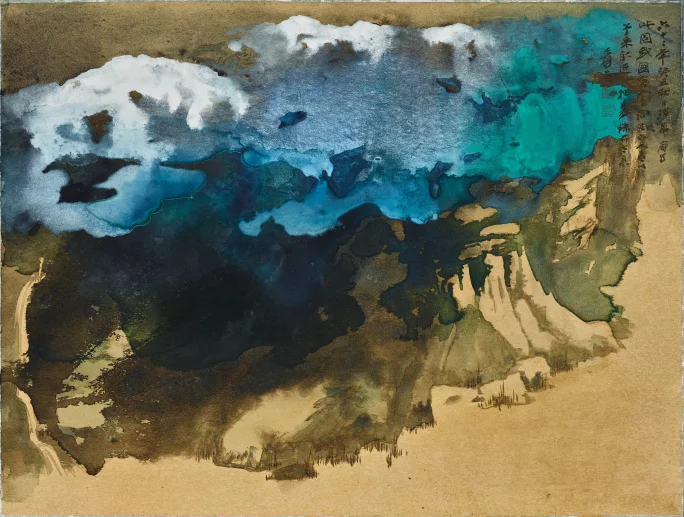

# yzhu0138_TUT2_Quiz8

## Part 1 — Imaging Technique Inspiration 

**My inspiration:**  
Splash Ink Landscape + Suminagashi Marbling + Refik Anadol’s *Melting Memories*.
## Image 

**Rationale:**  
After exploring a wide range of artistic works, I was deeply inspired by how ink, water, and motion intertwine across cultures and media. I intend to merge the expressive spontaneity of Chinese splash-ink landscapes, the hypnotic swirls of Suminagashi marbling, and the data-driven fluid aesthetics of Refik Anadol’s Melting Memories. Through this fusion, I aim to create a generative visual system where virtual ink breathes, drifts, and spirals in response to the user’s mouse movements—capturing both the organic uncertainty of nature and the structured elegance of algorithmic design.

---

## Part 2 — Coding Technique 

**Technique:**  
Perlin noise flow fields + reaction-diffusion (Gray–Scott) + WebGL fluid shader feedback in p5.js.

**How it helps:**  
I plan to combine three coding techniques to make my ink animation. The Perlin noise field makes small particles move smoothly like flowing ink. The reaction-diffusion pattern helps create the bleeding effect on paper, so the ink looks soft and natural. The WebGL feedback adds slow motion and swirling, making the scene feel alive. By blending these layers with transparency, I can get deep, rich ink textures. These techniques together make the digital ink behave more like real ink while still keeping it interactive and easy to control in p5.js.

**Demo and Code Links:**  
- [Flow Field Particles – The Coding Train](https://thecodingtrain.com/challenges/24-perlin-noise-flow-field?)  
- [Reaction-Diffusion – The Coding Train ](https://codingtrain.github.io/website-archive/CodingChallenges/013-reactiondiffusion-p5.html?)  
- [WebGL Fluid Simulation — PavelDoGreat (GitHub source)](https://github.com/PavelDoGreat/WebGL-Fluid-Simulation)

---

**Image References:** 
- [Suminagashi – Wikipedia](https://en.wikipedia.org/wiki/Suminagashi)
- [Refik Anadol – Melting Memories (Refik Anadol Studio)](https://refikanadolstudio.com/projects/melting-memories/)
- [Sotheby’s – Making a Splash: Discover Zhang Daqian’s Ink Masterpieces](https://www.sothebys.com/en/articles/making-a-splash-discover-zhang-daqians-ink-masterpieces)

